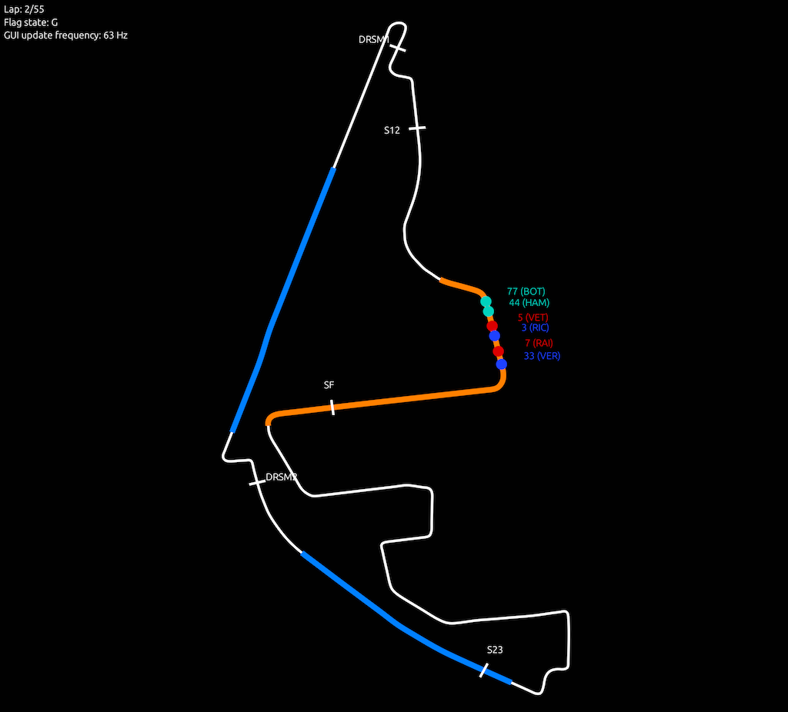

# Introduction
This repository contains a time-discrete race simulator written in Rust. Its purpose is to simulate
motorsport circuit races in order to evaluate race strategy decisions. The simulator considers
long-term effects such as tire degradation and burnt fuel mass as well as driver interactions. The
time-discrete approach has several advantages over a lap-discrete approach, e.g., a better modeling
of full-course yellow (FCY) phases (not implemented yet).

Some parts of this repository are focused on the Formula 1 racing series (since this is the racing
series for which the simulator was originally developed). However, most code can also be used for
other racing series. For example, the simulator allows driver changes during pit stops as required
for the simulation of endurace races.

Important hint: This project is not finished, it's more in a proof of concept state. Please keep
this in mind when using it.

Contact person: [Alexander Heilmeier](mailto:alexander.heilmeier@tum.de).

# List of components
The project is organized as a Rust workspace with four crates:
- `cli`: This binary crate provides the command-line interface to the simulator. It distinguishes
  between GUI and non-GUI as well as between single-thread and multi-thread execution. This is the
  binary that is finally invoked by the user.
- `gui`: This library crate contains the GUI (based on egui) showing the current positions of all
  race participants.
- `helpers`: This library crate provides some helper functions for the other crates.
- `racesim`: This library crate contains the race simulator. It is further divided into the `core`
  functionality, `interfaces` to other software (currently only the GUI), and `pre`- and
  `post`-processing related software parts.

# Running the race simulator
- `Step 1`: Adjust the given or create a new parameter file (.json) for the race you want to
  simulate. The parameter files are contained in `/input/parameters/`. If the GUI should be used
  please also locate a track file in the `/input/tracks/` folder.
- `Step 2:` Execute the simulator using `cargo run -- -p PATH/TO/PARAMETERFILE`. At least the path
  to a parameter file is required as a command line argument. `-g` activates the GUI (screenshot
  below) and real-time simulation so you can follow the race as it progresses. For further
  command-line options, check `cargo run -- -h`.



## Parameter files
Currently, only a parameter file from the 2017 Formula 1 race in Yas Marina is available. Even this
is not complete, as it only contains the six drivers from the three dominant teams at that time. It
only serves as an example for the expected input format and is not intended to re-simulate the
real race exactly. Adding more parameter files (based on the lap-discrete simulator's parameter
files) remains as a task for the future.

# Detailed description
The following sections should be helpful to understand the basic principles in the simulator.

## Background of the project
The functionality of the time-discrete race simulator is similar to the lap-discrete race simulator
I developed during my dissertation at the Institute of Automotive Technology at the Technical
University of Munich (link below). The lap-wise discretization of the simulator developed at that
time allows fast computing times, but limits the depth of detail and accuracy somewhat due to its
principle. This affects for example the correct modeling of safety car phases, lapped drivers, pit
stops, and accidents.

For this reason, after my time at the institute, I started to develop a new, time-discrete variant
of the race simulator in my free time. After a first implementation of the basic idea in Python, it
was clear that the computing times were too large for a reasonable use. Consequently, I started with
the implementation in Rust. The computing time per simulation is currently about 50 ms when using
the default time step size of 200 ms.

The project is developed irregularly depending on my available time. Currently, much of the
functionality that the lap-wise discretized race simulator has is still missing. This will be fixed
over time. An overview of the open features can be found below.

## Race simulator
The race simulator's functionality is divided among six structs. They are arranged as follows:
```
Race
|-- Track
|-- Car
|   |-- StateHandler
|   |-- Driver
|   |-- Tireset
```

The following sections briefly describe these structs. For more information, it is useful to look at
the publications listed below. Although these refer to the lap-discrete race simulator, the
underlying idea is similar in many respects.

### Race
The `Race` struct owns all other race elements. Its central method is `simulate_timestep`. As the
name suggests, it is used to simulate the race for a timestep. The call to this method is made
outside in the `handle_race` function (depending on whether the race is simulated in real time or as
fast as possible). The flow inside `simulate_timestep` is as follows:

1. Increment the discretization variable (`cur_racetime`).
2. Calculate the current lap time for each car based on the state after the previous time step. The 
   current lap time depends, for example, on the fuel mass, the age of the tires, the interactions
   between the drivers, and random influences. If a car is in standstill state during a pit stop,
   its lap time is infinite.
3. Update the race progress of each car for the given time step based on its current lap time.
4. Handle the situation if any car enters or leaves the pit standstill state in the current time
   step (if pits are located before the finish line).
5. Handle lap transitions for those cars that reached a new lap in the current time step.
6. Handle the situation if any car enters or leaves the pit standstill state in the current time
   step (if pits are located after the finish line).
7. Check if any car switches to a new state (see `StateHandler`) for the next time step.

For more information have a look into the `Race` struct's methods.

### Track
The `Track` struct has no methods of its own. It is used to provide various values that are needed
in the simulator's calculations, for example the start and end of pit lane and DRS zones, and the
track length.

### Car
The `Car` struct is initialized once per participating car. To work, it needs a `StateHandler`, a
`Driver`, and a `Tireset`. The `Car` struct provides several methods to the `Race` struct, which are
needed to run the simulation. One aspect is the calculation of the current lap time (depending on
car, driver, fuel mass, and tire age). Another aspect is the car-specific strategy and the
corresponding correct handling of pit stops (calculation of the standstill time, execution of the
pit stop).

### State Handler
The `StateHandler` struct keeps track of the current state of the corresponding car. There are
currently five states (documentation on them can be found above the struct's definition). Mainly it
is about whether the car is on a normal track section (no overtaking possible), in an overtaking
zone (overtaking possible if green flag), or in the pit lane. Depending on the situation when
a track section, other effects are also controlled here. For example, the DRS is activated if the
car is within the required distance to the car in front at a DRS measurement point.

### Driver
The `Driver` struct mainly provides the driver-specific tire degradation parameters for the tire
compound mounted on the car. The handling of these parameters in this struct makes it possible to
realistically represent driver changes in endurance races, since the new degradation behavior is
automatically set with a different driver.

### Tireset
The `Tireset` struct provides the calculation of the time loss due to tire degradation depending on
the tireset age as well as the driver-specific degradation parameters.

## Simulation accuracy
Since a lot of functionality is still missing, I have not done any evaluation of the simulator
results yet. This project is more a proof of concept for the time-discrete approach. If one day all
desired features are implemented, I will make a comparison to the lap-discrete approach.

# Features planned for the future
- [ ] Add FCY phases (Virtual Safety Car, Safety Car)
- [ ] Improve overtaking implementation
- [ ] Improve GUI (zooming, more information) and use circle if track file is not available
- [ ] Add probabilistic influences on lap times, start performance, pit stop durations, etc.
  including some evaluation scripts
- [ ] Add possibility to simulate hybrid and purely electric cars
- [ ] Improve/add test coverage on all library crates
- [ ] Improve documentation for all crates
- [ ] Add more parameter files

# Related open-source repositories
- Lap-discrete race simulator: https://github.com/TUMFTM/race-simulation
- Lap time simulator: https://github.com/TUMFTM/laptime-simulation
- Race track database: https://github.com/TUMFTM/racetrack-database
- Formula 1 timing database: https://github.com/TUMFTM/f1-timing-database

# Publications
The following publications are all related to the lap-discrete race simulator (link above).
Nevertheless, they are also of relevance for the time-discrete race simulator.

## Detailed description of the lap-discrete race simulator (deterministic parts)
Please refer to our paper for further information:
```
@inproceedings{Heilmeier2018,
doi = {10.1109/itsc.2018.8570012},
url = {https://doi.org/10.1109/itsc.2018.8570012},
year = {2018},
month = nov,
publisher = {{IEEE}},
author = {Alexander Heilmeier and Michael Graf and Markus Lienkamp},
title = {A Race Simulation for Strategy Decisions in Circuit Motorsports},
booktitle = {2018 21st International Conference on Intelligent Transportation Systems ({ITSC})}}
```

## Detailed description of the lap-discrete race simulator (probabilistic effects and random events)
Please refer to our paper for further information:
```
@article{Heilmeier2020,
doi = {10.3390/app10124229},
url = {https://doi.org/10.3390/app10124229},
year = {2020},
month = jun,
publisher = {{MDPI} {AG}},
volume = {10},
number = {12},
pages = {4229},
author = {Alexander Heilmeier and Michael Graf and Johannes Betz and Markus Lienkamp},
title = {Application of Monte Carlo Methods to Consider Probabilistic Effects in a Race Simulation for Circuit Motorsport},
journal = {Applied Sciences}}
```

## Detailed description of the virtual strategy engineer (VSE) included in the lap-discrete race simulator
Please refer to our paper for further information:
```
@article{Heilmeier2020,
doi = {10.3390/app10217805},
url = {https://doi.org/10.3390/app10217805},
year = {2020},
month = nov,
publisher = {{MDPI} {AG}},
volume = {10},
number = {21},
pages = {7805},
author = {Alexander Heilmeier and Andr{\'{e}} Thomaser and Michael Graf and Johannes Betz},
title = {Virtual Strategy Engineer: Using Artificial Neural Networks for Making Race Strategy Decisions in Circuit Motorsport},
journal = {Applied Sciences}}
```

# License
Licensed under either of <a href="LICENSE-APACHE">Apache License, Version 2.0</a> or
<a href="LICENSE-MIT">MIT license</a> at your option.

Unless you explicitly state otherwise, any contribution intentionally submitted for inclusion in
this race simulator by you, as defined in the Apache-2.0 license, shall be dual licensed as above,
without any additional terms or conditions.
